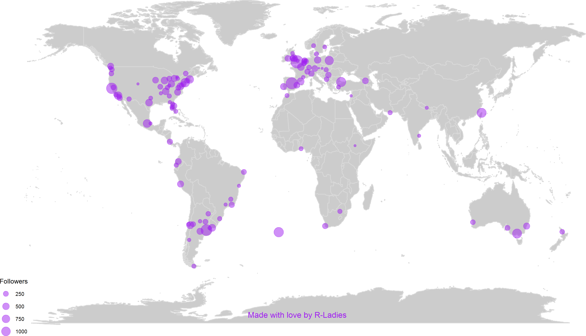
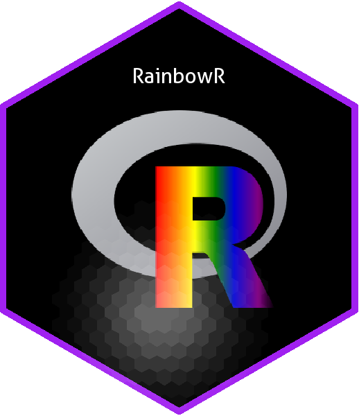
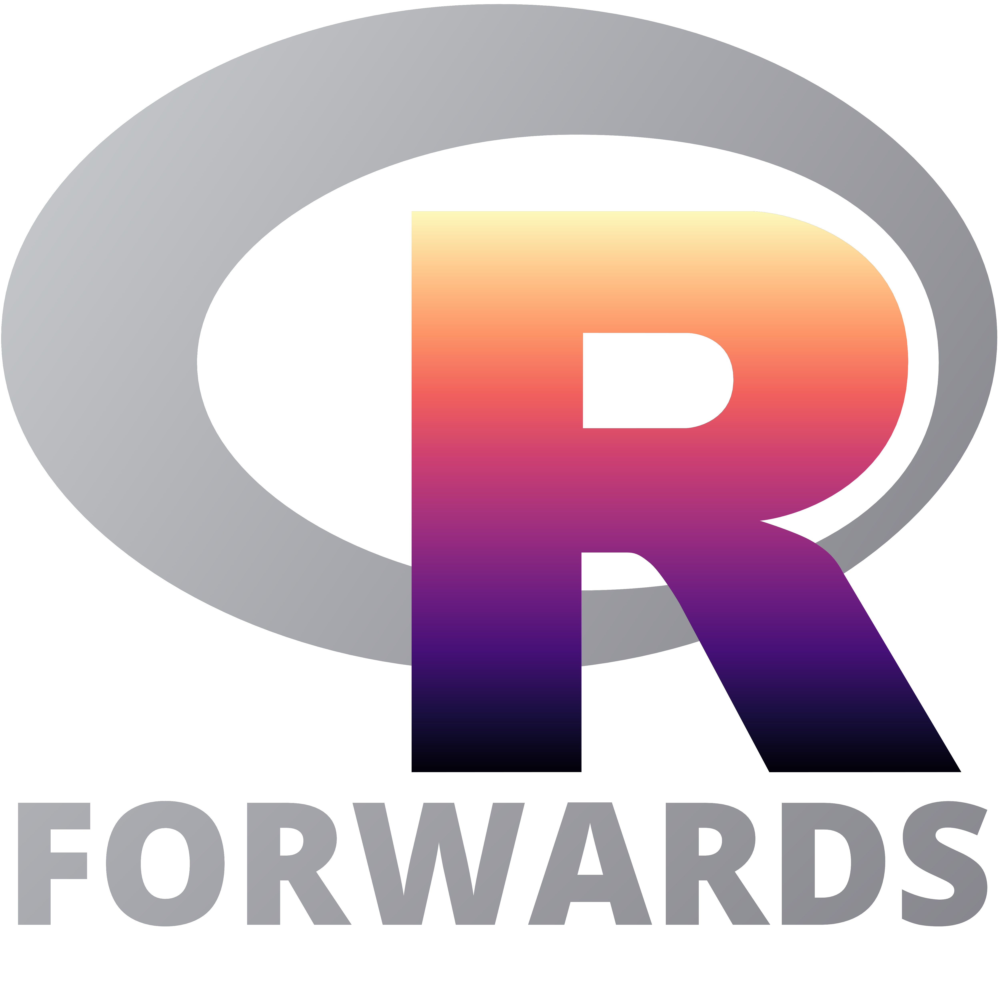
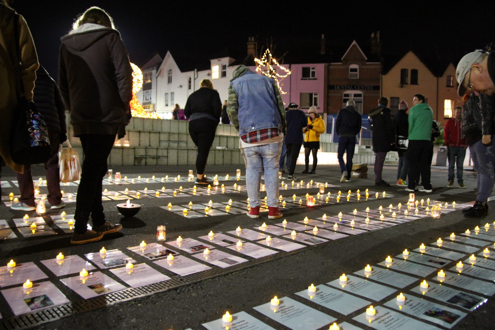
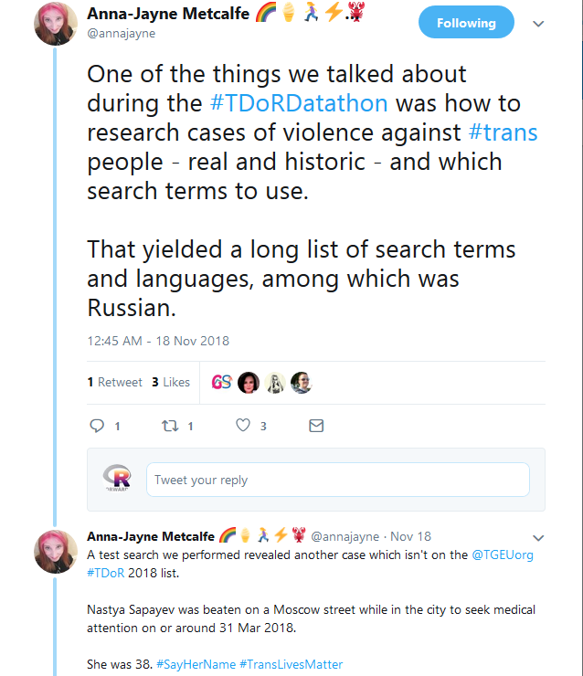
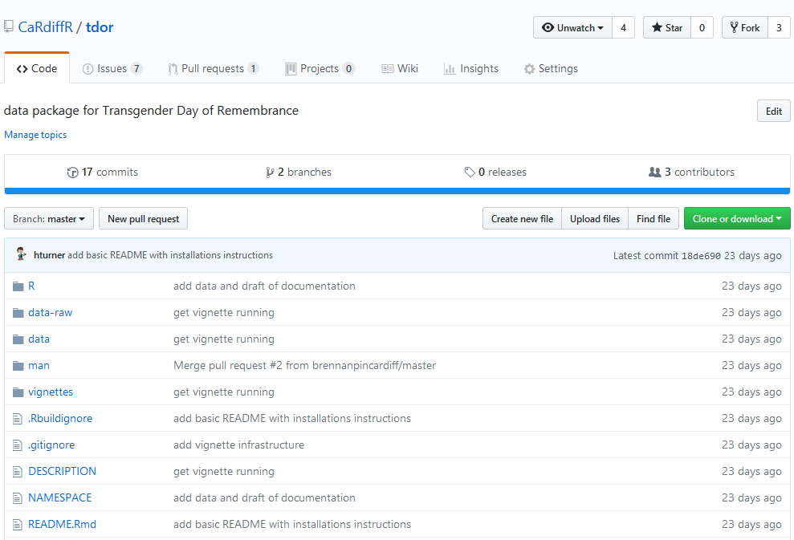
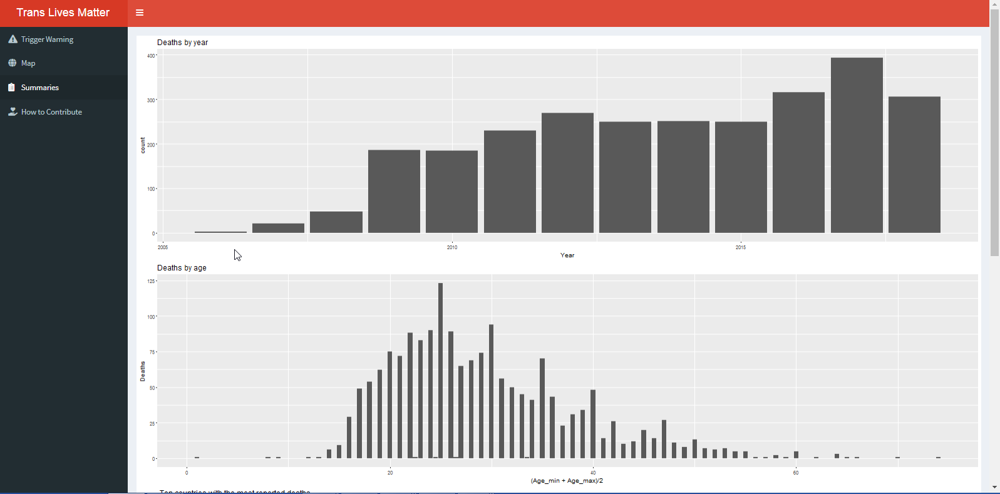
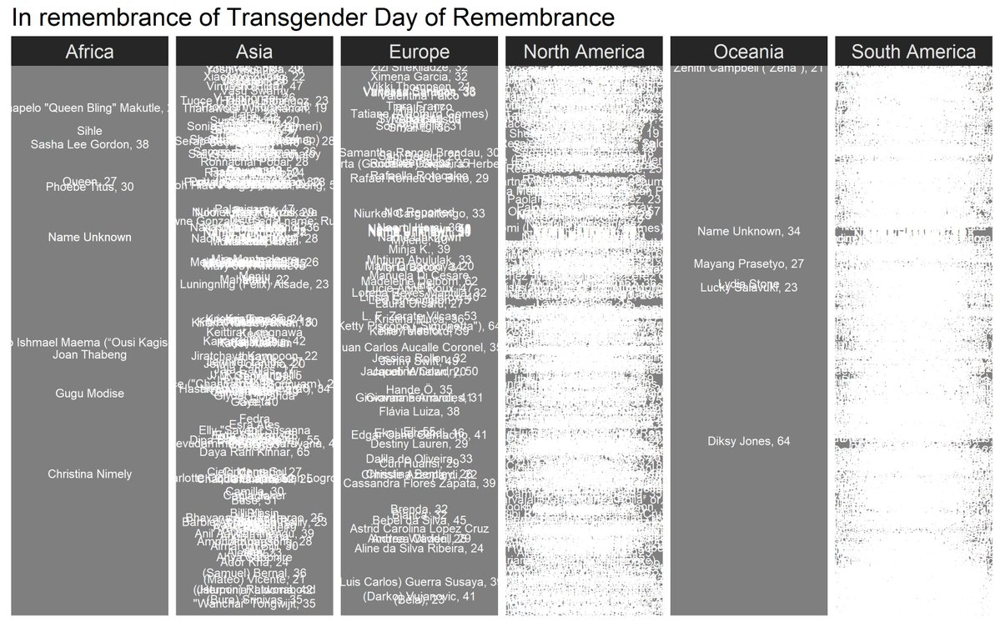
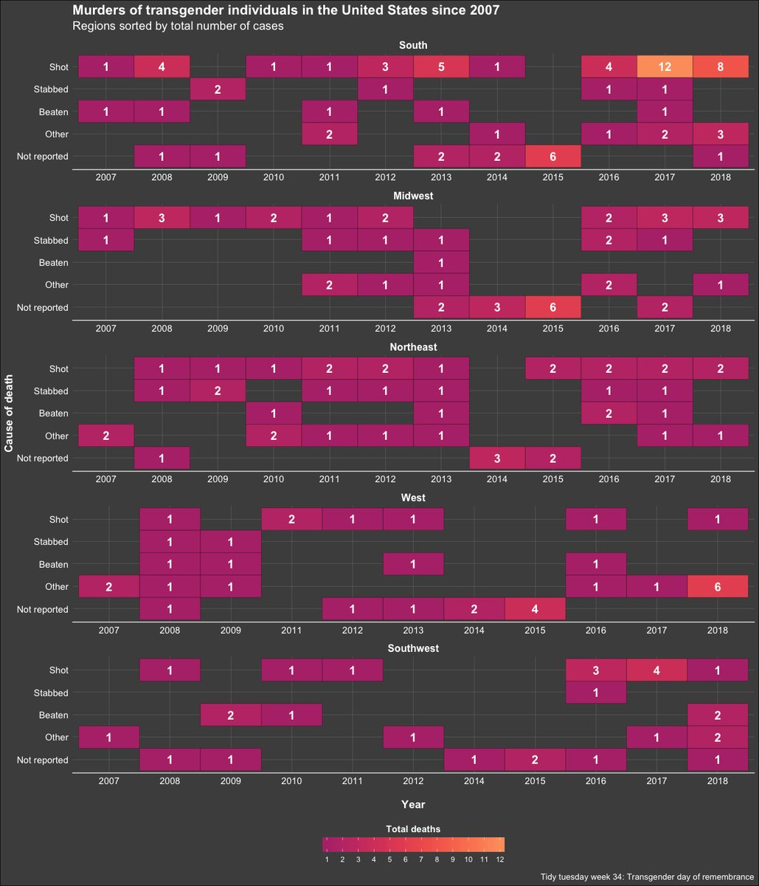
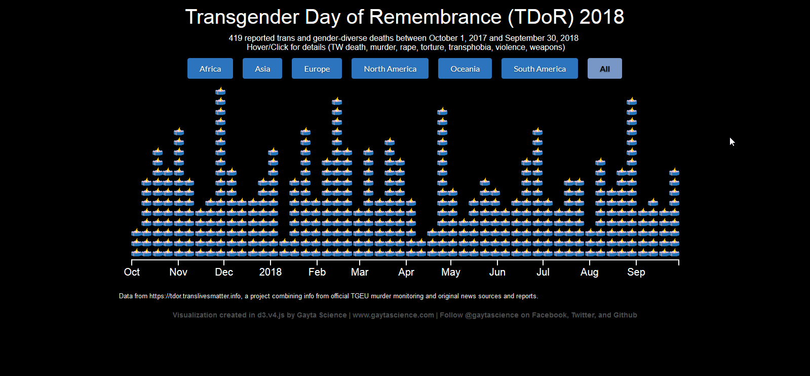

# R-Ladies

A world-wide organization to promote gender diversity in the R community.

<!-- ~120 groups across ~40 countries -->

---

# Rainbow R

.pull-left[
- Twitter @R_LGBTQ June 2018
- Slack July 2018
]

.pull-right[

]

---

# Forwards

.pull-left[
R Foundation taskforce on women and under-represented groups

- diversity @ useR! conference
- surveys
- on-ramps to contributing
- workshops
- social media
- outreach across groups
]

.pull-right[
 

]

---

# TDoR Datathon

.pull-left[
Joint Cardiff RUG, Rainbow R, Forwards event
 - main event Cardiff, Nov 17
 - continued after by collaborators worldwide
 
Collaborate on data set used for memorial events
 - website developed by Anna-Jayne Metcalfe
 - initially Trans*Code project June 2018
]

.pull-right[
 

]

---

# Data Crunching

.pull-left[

]

.pull-right[

]

---

# Dashboard

---

# TidyTuesday Visualisations

.pull-left[

]

.pull-right[

]

---

# gaytascience.com/tdor2018/

<!-- Kelsey Campbell they/them -->

---

# Credits

R Ladies world map: Daniela Vázquez @d4tagirl

Bournemouth TDoR vigil in November 2017: Anna-Jayne Metcalfe

Dashboard: Sara Stoudt @sastoudt

TDoR names: @shohct

TDoR US map viz: Liz Eisenhauer @LizEisenhauer 

TDoR US calendar viz: Harro Cyranka @harrocyranka

