```{r setup, include=FALSE}
knitr::opts_chunk$set(echo = TRUE, warning  = FALSE)
```

# R Forwards taskforce on women and other underrepresented groups

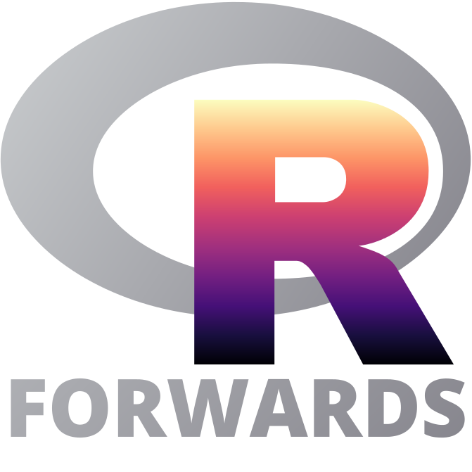

## Presentation
   Aim: improve the participation and experience of underepresented groups in the R community.
 
- December 2015: R foundation task force set up  to address the underrepresentation of women (__Rwomen__), 9 people

<!--There is a gender gap in both user and developer communities
Women in R Taskforce has been established to address this.-->

- 2016: Set broad goals based on computing/mathematical science community: developers (CRAN maintainers, GSoC students, ISC fund holders) __goal: >20% women__; user community (R conf attendees/speakers, RUG members) __goal: 30-40% women__. Start action focused on useR! Catalyse R Ladies global expansion

- January 2017: rebranded to accomodate more underepresented groups: LGBT, minority etnic groups, people with disabilities, call for new members, restructure with core team + 6 sub-teams (~30 members/collaborators) 

- Website: https://forwards.github.io/
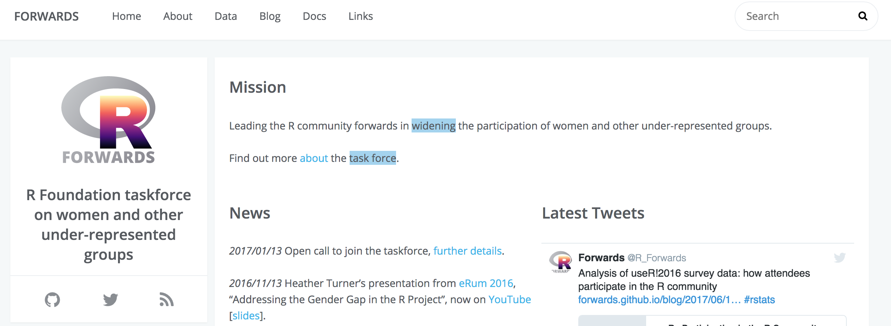</td>
- Tweets: @R_Forwards, Facebook

## Core team

<div align = "center">
<table id="nogrid">
<tr>
<td style="width:130px"></td>
<td>Jenny Bryan</br>CA</td>
<!--<td>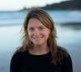</td>
<td> Alicia Oshlack</br>AU</td> -->

<td>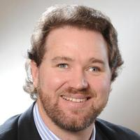</td>
<td>Jonathan Godfrey</br>NZ</td>
<td></td>
<td> Di Cook</br>AU</td>
</tr>

<tr>

<!--<td></td>
<td> Carolin Strobl</br>CH</td> -->

<td></td>
<td> Kevin O'Brien</br>IE</td>
<td>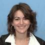</td>
<td>Julie Josse</br>FR</td>
<td></td>
<td> Heather Turner</br>UK</td>
</tr>


<td></td>
<td> Michael Lawrence</br>US</td>
<td>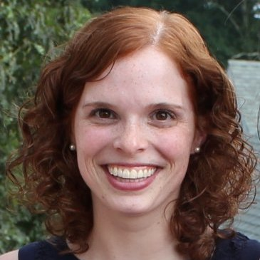</td>
<td>Emily Dodwell</br>US</td>
<td>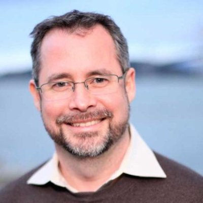</td>
<td>David Smith </br>US</td>
</tr>

<tr>


<!--<td> Gina Griffin</br>US</td>
<td>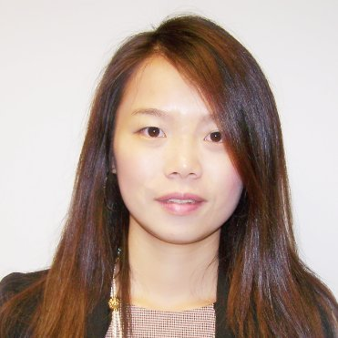</td>-->

<!--<td> Tracy Shen </br>US</td>
</tr> -->

<td>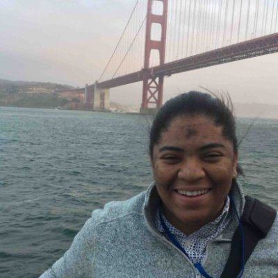</td>
<td>Jasmine Dumas</br>US</td>

<!--<td>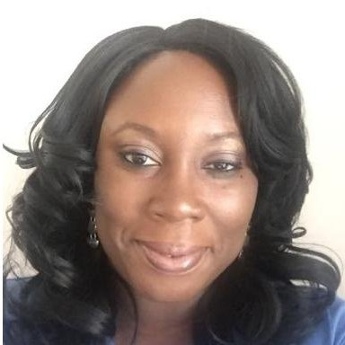</td>
<td> Madlene Hamilton  </br>US</td> -->
<td></td>
<td> Isabella Gollini  </br></td>
<td></td>
<td> Tatjana  Kecojevic  </br></td>
 
</tr>
</table> 
</div>
<!--Heather Turner - Chair, ‘Conferences’ team leader. 
Emily Dodwell - Administrator. 
Kevin O’Brien - ‘Community’ team leader. 
Julie Josse - ‘Conference’ team leader. 
Jenny Bryan - ‘On-ramps’ team Leader. 
Michael Lawrence - ‘On-ramps’ team leader. 
David Smith - ‘Social Media’ team leader. 
Jasmine Dumas - ‘Surveys’ team leader. 
Di Cook - ‘Teaching’ team leader.
Isabella Gollini - ‘Teaching’ team leader.
Jonathan Godfrey - Disability advisor.-->

- Link with the R Foundation;  R-Ladies; R Consortium (JB represent on new diversity group)
- New Forwards column in R Journal
- CoC and Anti-harassment policy - work in progress


 
## Subteams {.smaller}
M. Hamilton, C. Strobl,
G. Griffin, T. Shen,
J. Lee, I. Mitra, N. Tamir
G. Merchant, C. Wickham, W. Qin, 
S. Bollman, R. Debelak, 
J. Fox, M. Salmon, J. Robbins, A. Foulkes,
H. Wickham, L. Kellogg, D. Meza.

Forwards teleconf/ slackathons (virtual asynchronous meetings on slack) on alternate months. Github Repo.

- __Community__: General outreach to help people from under-represented groups get into R. Joint events with other data science groups, K. O’Brien, T. Allard.

- __On-ramps__: Creating paths for useRs to develop their skills and make contributions to the R/BioConductor ecosystem. J. Bryan, M. Lawrence.

<!-- On-ramps Creating paths for useRs to develop their skills and make contributions to the
R/Bioconductor package ecosystem. Activities have included speaking at the useR!
2017 newcomer session and R-Ladies meetings on collaborative coding--> 

- __Social Media__: Posting to Twitter and/or Facebook, soliciting blog posts and publishing them, maintaining website. D. Smith, A. Ragwitz. 

- __Teaching__: Materials and workshops for under-represented groups. I. Gollini, Di Cook.

- __Conferences__:  focus on R Foundation conferences, liaising with OC/PC on inclusion initiatives. H. Turner, J. Josse

- __Survey__: Running surveys, publishing reports
and data,   J. Dumas, T.  Kecojevic

## Conferences

- Apr 2016: recommendations to increase proportion of women at useR!

- useR! 2016: first __diversity scholarships__ and __mother's room__. In-depth survey.

- useR! 2017: first __conference buddies__, __newbie session__, 
__childcare__, __R-Ladies lunch__, __meet the diversity scholars__.  Demographic survey.
<!-- (special session for newcomers, collaborated with
R-Ladies),-->

- useR! 2018: free R tutorial for newbies. Collect demographic data during abstract submission.
Africa + Asia + South America approx = North America!, good rep from Aus/NZ
<!--(Will repeat demographic survey of participants).-->

 <!--
Not all above are strictly Forwards initiatives.-->

## Conference stats
<!--as conference attendees, speakers, committee members 
- At useR! 2016 results of recommendations -->
<!--- At useR! 2016: participants (28\%);  lightning (25%),  poster (28%), talks (19%) (2015: ~19\%); 50\% PC (results of recommendations) -->
<center>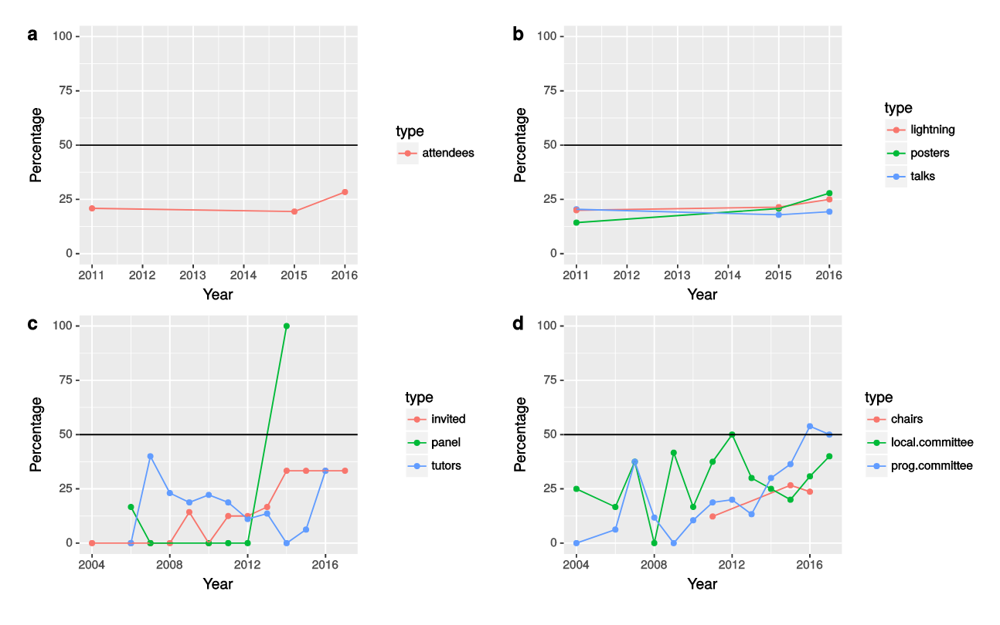</center>
<!--Goal:  comparable to computer science  (>20\%)  math/natural sciences (30-40\%)-->

- Keynotes: 50:50 2018

- Participants : 27\% 2017 -  2018

- Talks: 27.6\%	2017 -  31\% 2018

- Lightning talk/poster	26.3\% 2017 - 37.83 \% 2018


 <!--So ~24% non-male talks, a little up from usual and 38-39% non-male lightning/posters is much better than the norm! Also good to see that Africa + Asia + South America approx = North America! And of course good rep from Aus/NZ. -->

## Conference Code of Conduct

-  R Foundation policy is currently that conferences should have Code of Conduct (useR 2015 page is referenced), R foundation Conference Committee has asked forwards to update the CoC for useR! 

- Handling of issues that extend beyond individual conference -- longer term ban on repeat offenders, improvement of reporting mechanisms <!--(i.e. after conference if it was a one-time event)  Difficulties not to overreach (report to employers, ect).-->

- Word of caution: __this is a policy, not a legally enforceable document__ -- this perception is barrier to implementation
 
- Recent events suggest recommendations for anti-harrassment would be useful 
 
- Current status: JJ look at Python CoC (which was recently reviewed), ISBA policy (Kerrie Mengersen)

<!--
I also had quite a discussion about this with Achim Zeileis at eRum (who had also talk about it with Torsten Hothorn and Martin Maechler). I think the main points raised were: 
- The first draft was too prescriptive about what might happen if red flags were raised about suspected repeated/serious offence. A better approach would be something like 1. The small committee monitoring issues raises a red flag, triggering the R Foundation to review the case; 2. The R Foundation may decide no further action is necessary or perhaps to issue a formal warning from the R Foundation to the person concerned, simply noting why a red flag was raised and warning further violations may result in sanctions. Or if the R Foundation decide there is already enough cause for potential sanctions, at that stage a more formal process is triggered i.e. 3. The person concerned is asked to respond to the concerns, a second R Foundation meeting discusses the case again to decide if/what sanctions should be applied.
- Regarding reporting even small issues, there was concern that people would be too heavily penalised for a one-off unthinking mistake, e.g. saying something off in a talk. Even that people might be so worried about making a mistake that they would be put off attending/contributing. So we somehow need to get the balance right: not causing fear/paranoia by introducing monitoring and if people do slip up trying to handle it fairly with the ideal being not to exclude anyone (because people put things right, not because we give people a free pass).
Generally the RFCC were happy with the revised CoC (subject to minor corrections!) as long as the local organizers are given the flexibility to adapt to local circumstances and respond to incidents as they see fit. They had more questions/issues about the anti-harassment policy, but that is beyond the scope of the RFCC in any case, so comments on that part are not official RFCC view, just indicative of the issues likely to be raised when we put these recommendations to the full R Foundation.
It would be great if you could add any thoughts on the current draft/general principles over the next few weeks. @juliejosse will lead an effort to redraft what we've got around/during the May slackathon - this will be easier with input from yourselves! Thanks to those that have already commented on GitHub, it helps to clarify some of the issues.

-->

## Subteams 
### __Community__

- Forwards represented at:  AlterConf,  Afro Tech Festival, Trans*Code International Transgender Day of Visibility Hackathon, National Federation of the Blind Convention, and Society for Advancement of Chicanos/Hispanics and Native Americans in Science. Kevin O’Brien. One-to-one basis, need more, R community would come on in leaps and bounds.
 
<!--On behalf of R Forwards, I attended the Afro Tech Festival in London in January 2018. It was a low key visit, and I spent most of my time talking with other attendees on a one-to-one basis, getting their views of how the Tech Community feels for BAME (Black, Asian and Middle Eastern) community.
I came across some groups that we could work with in the near future, but until something specific is confirmed, I am not sure we should mention it.
It would be great to see this effort result in Scholarships for UseR! 2019.

In June 2018 I took part in the Trans*Code hackathon in London. My visit was similar to Afro Tech Fest in that I talked with people on a one-to-one basis. I also took part in a Transgender Day of Rememberance Website Project.

I am still trying to figure out what to say about where this is going.

I hope that other people in the R community (RUG leaders specifically) would take the time to reach out to URM groups in their areas. One person make one or two trips is not a lot, but if more people do it, then the R community would come on in leaps and bounds. -->

<!--The team promotes outreach schemes such as NASA
Datanauts and works alongside others in the R community seeking to widen participation,
such as R-Ladies or other sub-teams, for example co-ordinating the diversity
scholarship scheme for useR! 2017.-->


### __Survey__

- useR! 2016: demographics, programming experience and community involvement of useR! attendees.
Get input from the community on obstacles and ideas for improvements. 

- Create template for useR! surveys, update summary of CRAN maintainer demographics, 
[__new privacy policy__](https://rforwards-auto.github.io/docs/privacy_policy/) (GPDR, clear about intentions of data collection and what happens to it)
<!--new data regulation protections in EU and clearer about intentions of data collection (and what happens to it afterwards)-->

## Teaching

Materials and workshops for under-represented
groups. 

Fund Infrastructure Steering Committee (ISC) R consortium.

- __Girls workshops__ (Jenny Brian, Hadley Wickam, Di Cook): Melbourne, Oct 28, Year 11 - Auckland, Dec 8, Year 12. <!--Interested in STEM, coding and data analysis.--> co-organized with R ladies
__Create shiny app__ to explore 2015 OECD data on international student achievement. <!--One of the apps developed can be viewed at https://t.co/zlw3HGzOaR. -->
- __Women workshops__ (JB, HW, DC):  Melbourne - Auckland, Dec 7. Learn to make, submit  an R package, collaborative coding with github,  write a vignette or article.
<!--Women who have done some R coding and are ready to take the next step in providing it to others to use. -->

Repeats planned for Europe and North America. E. Dodwell looking workshop at AT&T Labs this year.

eRum, May 14 Budapest, one-day package workshop (Isabella & Heather). 8 women funded by R Consortium grant, + 4-5 self-funded.
satRday,  23rd June Cardiff  (Heather) 

eR-Biostat: making R based education materials accessible for all

## R activities

- __R in Africa__: satRdays in Cape Town (Feb 2017, March 2018) - R ladies meetup Capetown -  30 workshops were run in countries like South Africa, Mauritius, Ghana, Gabon, Namibia, Botswana, Kenya, and Ethiopia. Data carpentry, software carpentry. R ladies Addis Ababa - 
start in Cotonou, Benin.  More groups planned.

- __R in latin America__, first events in Brazil, satRday Bogota (august), LatinR 2018 (sept, Buenos Aires) ConectaR 2019 (endorsed)

## Summary/Call for action

- Lot of work! Thank you for the efforts to improve diversity and inclusion

- Current issues in tasks repo, [work in progres](https://github.com/orgs/forwards/projects),  [ideas for future work](https://github.com/forwards/tasks/issues?utf8=%E2%9C%93&q=is%3Aopen+is%3Aissue+no%3Aassignee+no%3Aproject),  [past minutes](https://github.com/forwards/meetings), update webpage

- Anyone is welcome to promote welcome culture. Contributions to "on-ramps" to package dev/contrib to R project welcome. Possible opportunities here:
    * proposed task to support first CRAN submission (e.g. for workshop graduates)
   * consider emulating the Debian Women mentoring scheme? (https://www.debian.org/women/mentoring)
    * take on a "GitHub concierge"? (https://github.com/ropensci/unconf17/issues/45)
    * seek diverse volunteers for R bugs triage?


  


                                                   

