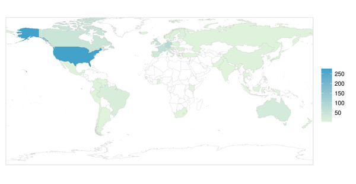
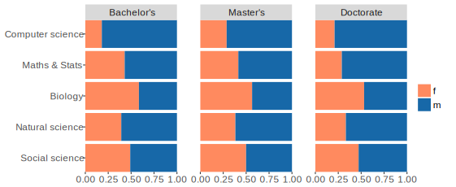

## Taskforce on Women in R

<h3>Di Cook</h3>

#### and Heather Turner, Jenny Bryan, Julie Josse, Oliver Keyes, Michael Lawrence,  Kevin O'Brien, Alicia Oshlack, Carolin Strobl
####   Oct 20, 2016

## The R Community - 2007

<small>

</small>

## The R Community - 2007

<small>

</small>

## The R Community - 2015
<small>

 &copy; Torben Tvedebrink 2015</small>

## The R Community - 2015
<small>

 &copy; Torben Tvedebrink 2015</small>

## The R Community - 2015
<small>

 &copy; Torben Tvedebrink 2015</small>

## The R Community - 2016

<small>

</small>

## The R Community - 2016

<small>

</small>

## The R Community - 2016

<small>

</small>

<!---
## The R Community
<small>

 &copy; Torben Tvedebrink 2015</small>
--->

## Where we are now?

- How well are women *actually* represented in the R community? And in what capacity?
    - Conferences
    - Packages
    - Google Summer of Code
    - R Foundation, R Core
    - Publications
    - R-Ladies

## 2010 Survey of Packages

- 2010 survey of 1087 maintainers of packages on CRAN/Bioconductor plus contributors on 
R-forge&#185;
- 9% of package authors were women (95% CI: 7.1 - 11.0%)
- 32.5% were from the USA

<small>&#185;Mair, P., Hofmann, E., Gruber, K., Hatzinger, R., Zeleis, A. and Hornik, K. (2015) Motivation, values, and work design as drivers of participation in the R open source project for statistical computing, Proc Nat. Acad. Sci.</small>

## Conferences

- useR! has already been working to improve diversity
    - gradual increase in number of female keynotes
    - code of conduct introduced in 2015
    - diversity scholarships & mothers' room in 2016
    

## useR! 2015 

- [http://user2015.math.aau.dk](http://user2015.math.aau.dk)
- ~19% participants were women
- ~20% of presentations

<!-- possibly Rencontres stats here: 4/16 talks, 6/11 posters, 3/10 lightning -->

## R Packages

 - All CRAN maintainers (Mar 2016) processed with **genderizer**
    - uses databases to predict gender from first name
 - Supplemented by manual assignment
 - 14.8% package authors "female", 11.4% with P(gender) &ge; 0.8
 
 

## Other R Project Contributions

 - 18% Google Summer of Code 2015 mentors were women (9 individuals)
 - In remaining cases, percentages represent one or two women
 

## Publications: JCGS

## Where should we be?

## US Students

 - US National Center for Education Statistics (2013-14)
 - Computer science ranges from 18% (Bachelor's) to 29% (Master's) female
 - Others range from 29% to 58% female
 
 
 
## US Occupations

 - Data from American Community Survey 2014
 - 22% female programmers
 - Other scientific/analytic occupations at least 41% female
 
  
  
## Goals for R Community

 - Developers (CRAN maintainers, GSoC students, ISC funding holders) should at 
 least be comparable to computer science figures
    - &gt; 20% women
 - Broader user community (R conference attendees/speakers, RUG members) should at least be comparable to mathematical/natural sciences
    - 30-40% women
    
     
 
## How can we get there?
 

- Keep data
- Build developer capacity
- Community support

 

## Data Monitoring

 

<table style = "border-bottom: 3px solid #ddd !important">

<tr style = "border-bottom: 3px solid #ddd !important">
<td></td>
<td> **Details** </td>
<td> **Done** </td>
<td> **To Do** </td>
</tr>

<tr>
<td>useR!</td>
<td>attendees, invited speakers, presenters (talk/lightning/poster), chairs, committee members (local/program)</td>
<td>2015</td>
<td>2004-2014</td>
</tr>

<tr>
<td>packages</td>
<td>CRAN maintainers/authors, others?</td>
<td>maintainers</td>
<td>authors</td>
</tr>

<tr>
<td>GSoC</td>
<td>students, mentors</td>
<td>2015</td>
<td>2008-2014</td>
</tr>

<tr>
<td>ISC projects</td>
<td>proposers</td>
<td>funded</td>
<td>rejected?</td>
</tr>

<tr>
<td>R Journal</td>
<td>editors, authors </td>
<td>editors</td>
<td>authors</td>
</tr>

</table> 

 

## Surveys

- Get input from the community on obstacles and ideas for improvements
- Target survey at particular populations, e.g. useR! attendees, local user group attendees, package maintainers, R-help users, StackOverflow users
- Create bank of questions and customise survey for target group
- First survey conducted as part useR! 2016 participants (June 27-30)
- Analysis in the works

 

## Information Central: Website/GitHub

- http://forwards.github.io/
    - Summary of where we are
    - Events calendar
    - Data and code for gender summaries
    - Links to resources on diversity in tech
    - Slides from talks
    - More as initiative develops!

<!--- 

 --->
<iframe data-src="http://forwards.github.io/" height = 500 width = 650></iframe>

  

## Conferences

* The taskforce made recommendations for useR! 2016 <small>  </small>
<table style = "border-bottom: 3px solid #ddd !important"><tr style = "border-bottom: 3px solid #ddd !important"><td> **Recomendation** </td><td> **Action** </td></tr><tr><td>50:50 program committee </td><td>7:6 female:male</td></tr><tr><td>50:50 session chairs</td><td>7:18</td></tr><tr><td>&ge; 20% women on panels</td><td>NA</td></tr><tr><td>put gender stats on website</td><td>not done</td></tr></table>
  
* Future useR!s
     - maintain current gender balance for invited speakers
     - aim for similar gender balance for tutorials: 28% had female tutor in 2015
- useR! 2017 proposal includes offering childcare
  
## Community building: RLadies

## RLadies - London

- Example events
    - drop-in session for beginners
    - tutorials
    - "Tour de R"
    - SF uncubed: recruiting tech event 
    
 <small> credit: Chiin-Rui Tan</small>

## RLadies - Melbourne Oct 18

## RLadies - Melbourne Oct 18

## RLadies - Melbourne Oct 18

## rOpenSci

 - R packages to access scientific data; visualize; document & share data
 - Community support:  open review process, support with maintenance, package promotion
 - Unconference (43% non-male)

  <small> credit: Gabriela de Queiroz</small>

## Australian rOpenSci 2016

## Australian rOpenSci 2016

## Community building: Twitter
    

- <b>@RWomenTaskforce</b>
    - promote female-led R workshops/webinars
    - share articles/initiatives on encouraging diversity
- Share info to tweet/re-tweet:
    - GMT: <b>@dragonflystats</b>, kobriendublin@gmail.com
    - Pacific: <b>@JennyBryan</b>, jenny@stat.ubc.ca
    - AEST: <b>@AliciaOshlack</b>, alicia.oshlack@mcri.edu.au

<a class="twitter-timeline" data-width="650" data-height="500" data-theme="light" href="https://twitter.com/RWomenTaskforce">Tweets by RWomenTaskforce</a> 
<!---

--->

  

<!---
## Activities so far

- Data gathering
- Actions to improve participation at useR!
- Communications
    

<table id = "nogrid">
<tr>
<td style="line-height: 50px;">
 @RWomenTaskforce </td>
<td> http://forwards.github.io/</td>
</tr>

<tr>
<td></td>
<td></td>
</tr>

</table> 

## Some Ideas for Future Activities
    

<table id="noborder">

<tr>
<td> Women in R workshops</td>
<td> More R-ladies chapters</td>
</tr>

<tr>
<td> <small>e.g. Coding Grace model (credit: @CoderGirlsRock)</small></td>
<td> <small>e.g. PyLadies model (http://www.pyladies.com/)</small></td>
</tr>

<tr>
<td> </td>
<td> </td>
</tr>

</table> 

    

## Some Ideas for Future Activities
    

<table id = "nogrid">

<tr>
<td> On-ramps for contributors<small></td>
<td> Women in R directory</td>
</tr>

<tr>
<td> <small>e.g. GitHub social coding model (**pystr**)</small></td>
<td> <small>e.g. WiML model (http://wimlworkshop.org/) </small></td>
</tr>

<tr>
<td> </td>
<td> </td>
</tr>

</table> 

  
--->

## Recruiting Ambassadors

- WiR emailed prominent women in R community

- Some already active, other prompted to act as ambassadors

> <small>I am actually working with the conference committee on funding a female 
> grad student or post doc to go to the conference ...
> I will definitely get the word out 
> -- Mine Çetinkaya-Rundel, email</small>

<!--- http://www.meetup.com/R-ladies/messages/boards/thread/49654757#129001411 --->
> <small>I'm making myself available to help on giving feedback, helping on ideas, 
> reviews of abstracts, etc. I would love to see more R-ladies presenting at useR! 
> -- Gabriela de Queiroz, message on meetup</small>

<!---
## Recommendations for Future useR!s

 - Maintain current gender balance for invited speakers
 - Aim for similar gender balance for tutors
     - 28% tutorials have woman tutor this year
 - Consider favouring women on borderline abstracts
  
 
 - useR! 2017 proposal includes offering childcare
     
     
-->

<!---
## Effectiveness of Email Campaigns

 - The Society for Political Methodology Summer Meeting ran a randomised control 
 trial to test effect of personalised invitations&#185;
     - 3945 graduate students in Top 50 political science programs
     - treatment group received 2 emails, control received none
 - Those in the treatment group are more likely to apply
     - some evidence women responded more strongly
 - BUT acceptance rates in treatment group lower than in control
 - Problems in application to R community
    - identifying target population
    - risk of putting people off that are invited but not accepted
    
<small>&#185;Unkovic C, Sen M, Quinn KM (2016) Does Encouragement Matter in Improving Gender Imbalances in Technical Fields? Evidence from a Randomized Controlled Trial. PLoS ONE 11(4): e0151714.</small>

## 10 Simple Rules to Achieve Gender-Balanced Program&#185;

1. Collect the Data
2. Develop a Speaker Policy (Targets)
3. Make the Policy Visible
4. Establish a Balanced and Informed Program Committee
5. Report the Data

<small>&#185;Martin JL (2014) Ten Simple Rules to Achieve Conference Speaker Gender Balance. PLoS Comput Biol 10(11): e1003903.</small>

---

6. Build and Use Databases
    - currently nothing specific to R community
7. Respond to Resistance
    - meritocracy argument ignores (unconscious) bias & systematic disadvantage
8. Support Women at Meetings

    > If you're going to spend money on an open bar instead of childcare… 
    > you should rethink what you're doing 
    > -- Jonathan Eisen
    
9. Be Family Friendly

---

10. Take the Pledge
    - When invited, ask to see conference speaker policy first
        - help draft one if it doesn't exist!
    - Ask to see list of invited people
        - if poor gender balance, point this out!
        - suggest female speakers/give joint talk with female colleague
        
<!--- also twin cities (minneapolis-saint paul) and Taiwan --->

<!---
## Objectives

> Women-only spaces are a hack
> -- Julia Evans, http://jvns.ca

* Women-only or female-majority events can help women feel safer

* Goal is NOT to segregate by gender but to provide a gateway to community at 
large
--->

## R User Groups

* 237 local RUGs
* Heading for 20 RUG meetings per week, somewhere in the world
* Short talks, "show and tell"

## RUGs as a Springboard

- Opportunity for women
    - practice public speaking (conference format)
    - get feedback on projects
    - relatively low-cost (short talk, local venue)
   
- Organisers can help
    - small numbers of speakers: not so hard to balance program
    - try lightning talks, e.g. recent DublinR 2 male, 3 female
    - low risk inviting new people
   
## Female-friendly R Workshops

- Not restricted to R-ladies groups!

    - female only/ males +1s
    - majority female mentors
- Potential Women in R workshops?
    - beginner workshops in partnership with RUGS
    - summer school for aspiring package developers (Europe 2018)

<!-- from 2006 to 2013 
## Motivating Learning

 - Programming often introduced as
     - a necessary evil
     - a skill required for high-paying jobs
 - Harvey Mudd College increased computer science majors from 10% to &gt; 40%:
     - emphasize creative problem-solving
     - segregate by background/don't let whizz kids dominate
     - showcase women in tech/real case studies
     - provide early opportunities to contribute
-->     
     
     
     
## Google Summer of Code

 1. Mentors/students propose 3 month projects
 2. Google awards a fixed number of student slots
 3. Admins & mentors select projects
    - student earns $5500 
    - mentors benefit from contribution to their project

R's contribution from ideas to implementation managed via GitHub
[github.com/rstats-gsoc](github.com/rstats-gsoc)

## Google Summer of Code
<!--- 23 projects --->
[summerofcode.withgoogle.com](https://summerofcode.withgoogle.com)

## On Ramps for Contributing

 

- Several R packages on GitHub have a CONTRIBUTING.md 
    - often not designed for novices
- Target issues at novices
<!--    - many tags in use: first-timers-only / 
    good-starter-issue / low hanging fruit / easy -->
    - use tags
    - step-by-step instructions
    

<small>credit: Charlotte Spencer</small>

<!---
## Developing Developers

- Ensure students/researchers gain software carpenty skills
    - Reproducible research
    - Version control
    - Package development
- Encourage publication    
    - CRAN/Bioconductor submission vs supplementary code
    - JOSS/R Journal/JSS paper
--->    
 
## Mentoring

- Open issue on GitHub and Tweet request for review
- Study group/RUG code swaps
- Consultancy
- Scaling rOpenSci???

## R Consortium ISC

- The R Consortium is a framework for the support of R by industry
- Its Infrastructure Steering Committee offers funding for projects
    - software development
    - developing teaching materials
    - documenting best practices
    - standardising APIs
    - research
 
<!---   
## Tips from ISC Committee

- Think big: something that will benefit a sizable portion of the community
- Collaborate: seek expert opinion and find potential collaborators
- Do your homework: make sure you understand what relevant work already exists
- Write a detailed proposal estimating work, resources and money required
--->

 

## Funded ISC Projects

- **R-Hub**: pre-test CRAN packages on multiple platforms, automate package building
- A unified framework for distributed computing in R
- Improving database interface (**DBI**)
- R Implementation, Optimization and Tooling Workshops (**RIOT**)
- R Localization (**RL10N**): enable packages to include translations
- **SatRdays**: regional conferences
- Simple Features access for R: utilities for geospatial data
- Software Carpentry R instructor training

## Take-homes

## For Women Starting Out

- Find support: R-ladies/RUG/Study group
- Start small
    - Contribute to existing package
    - Make a package of personal utility functions
- Put on your flame-proof suit and ask stupid questions 

    > If nm is double, very likely INTEGER(nm)[0] is negative and your C code 
    > does nothing at all.  Hence it could be fast but useless.  
    > -- Reply to Heather on R-help, 2005

- Publish code to get feedback and credit

## For Established Women

- Stay visible
    - Speak at conferences
    - Don't hang out in clique at meetings 
    - Be active online: Twitter, Blog, StackOverflow, GitHub, ...
- Mentor other women
    - R-ladies/Female-friendly workshop
    - Encourage contributions on own projects, GSoC
    - Suggest names for conferences, and insist on balance
- Consider applying for ISC funding    
    
## For Everyone

- Be aware of (other) women's contributions
    - Attend talks - even if you can only drop in
    - Invite women to low-key events (RUG, departmental seminar)
- Encourage women's participation
    - Nominate for speakers, committee members, awards, ...
    - Invite onto your project
- Promote welcoming culture
    - Use gender neutral language
    - Give constructive feedback

## R Foundation Women in R Taskforce

> to improve the participation and experience of women in the R community

<table id="nogrid">
<tr>
<td style="width:130px"></td>
<td>Jenny Bryan CA</td>
<td></td>
<td> Alicia Oshlack AU</td>
<td></td>
<td> Oliver Keyes US</td>
</tr>

<tr>
<td></td>
<td> Di Cook AU</td>
<td></td>
<td> Carolin Strobl CH</td>
<td></td>
<td> Kevin O'Brien IE</td>
</tr>

<tr>
<td></td>
<td>Julie Josse FR</td>
<td></td>
<td> Heather Turner UK</td>
<td></td>
<td> Michael Lawrence US</td>
</tr>
</table> 

<!---    
## Support us on Twitter    

- Follow @RWomenTaskforce, we
    - promote female-led R workshops/webinars etc
    - advertise R conferences/events
    - advertise opportunities for women (grants/awards/jobs etc)
    - support women advancing in R (via likes)
    - share articles/initiatives on encouraging diversity
- Share information to tweet/re-tweet:
    - GMT: @dragonflystats, kobriendublin@gmail.com
    - Pacific: @JennyBryan, jenny@stat.ubc.ca
    - AEST: @AliciaOshlack, alicia.oshlack@mcri.edu.au
--->    

<!--- 
## Further opportunities

 - We are looking for:
    - Organisers/mentors for training
    - Web developers
    - R-ladies founders
    - Sponsors
 - Potential for co-ordinating funding applications
 - Ideas/offers to rowforwards@gmail.com
 

## Resources

- Our website current offers
    - Summary of where we are
    - Events calendar
- Coming soon
    - Data and code for gender summaries
    - Links to resources on diversity in tech
    - Survey results
    - More as initiative develops!
--->    
    
## Summary

- Women are under-represented in both user and developer communities
    - Users ~ 20% women; goal 30-40% women
    - Developers ~ 10% women; goal 20% women
- Women in R Taskforce has been established to address this
    - Current focus: data gathering, communications
    - Future work: outreach

     

@RWomenTaskforce

http://forwards.github.io/

    
<!--- Left out, possibly mention
bioconductor review process
add Rails Girsl page?
add core mentoring (Python) page 
https://twitter.com/pyladies/status/737682620700463104
!--->

<!--- Reducing images to required height, convert to jpeg for much smaller file
with imagemagick, e.g (400x for width 400)
convert "twitter_orig.png" -geometry x400 twitter.jpg
--->
