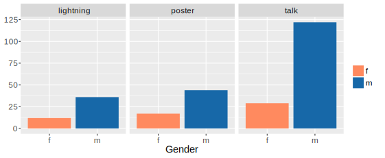
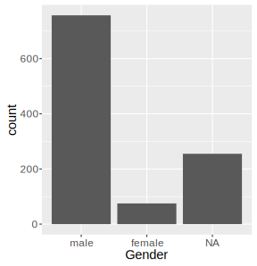
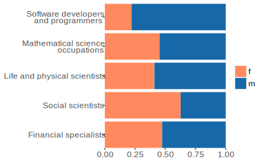
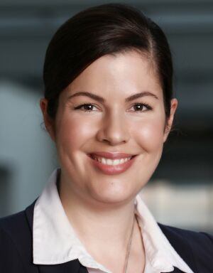

## Addressing the Gender Gap in the R Project

<h3>Heather Turner</h3>
<h4>*and the Women in R Taskforce:*</h4>

#### Jenny Bryan, Di Cook, Julie Josse,  Oliver Keyes, Michael Lawrence, Kevin O'Brien,  Alicia Oshlack, Carolin Strobl
####   October 13, 2016

## What gender gap?

## Conferences

- At useR! 2016, 28% participants were women

- The percentage of female presenters was higher for lightning (25%) and poster 
(28%) vs talks (19%)

- In 2015 all above percentages were ~19%

<!-- possibly Rencontres stats here: 4/16 talks, 6/11 posters, 3/10 lightning -->

## Packages
<!--4,274 emails, i.e. email everyone, got ~25% response -->
- 2010 survey of 1087 maintainers of packages on CRAN/Bioconductor plus contributors on 
R-forge&#185;
- 9% of package authors were women (95% CI: 7.1 - 11.0%)
- 32.5% were from the USA

<small>&#185;Mair, P., Hofmann, E., Gruber, K., Hatzinger, R., Zeleis, A. and Hornik, K. (2015) Motivation, values, and work design as drivers of participation in the R open source project for statistical computing, PNAS</small>

## Packages

 - All CRAN maintainers (Mar 2016) processed with **genderizer**
    - uses databases to predict gender from first name
 - Supplemented by manual assignment
 - 14.8% package authors "female", 11.4% with P(gender) &ge; 0.8
 
 

## Other R Project Contributions

 - 18% Google Summer of Code 2015 mentors were women (9 individuals)
 - In remaining cases, percentages represent one or two women
 

## What are we aiming for?

## US Students

 - Source: US National Center for Education Statistics (2013-14)
 - Computer science ranges from 18% (Bachelor's) to 29% (Master's) female
 - Others range from 29% to 58% female
 
 
 
## US Occupations

 - Data from American Community Survey 2014
 - 22% female programmers
 - Other scientific/analytic occupations at least 41% female
 
  
  
## Goals for R Community

 - Developers (CRAN maintainers, GSoC students, ISC funding holders) should at 
 least be comparable to computer science figures
    - &gt; 20% women
 - Broader user community (R conference attendees/speakers, RUG members) should at least be comparable to mathematical/natural sciences
    - 30-40% women
    
     
 
## How can we get there?

## Women in R Task Force

> to improve the participation and experience of women in the R community

<table id="nogrid">
<tr>
<td style="width:120px"></td>
<td>Jenny Bryan CA</td>
<td style="width:120px"></td>
<td> Alicia Oshlack AU</td>
<td style="width:120px"></td>
<td> Oliver Keyes US</td>
</tr>

<tr>
<td ></td>
<td> Di Cook AU</td>
<td></td>
<td> Carolin Strobl CH</td>
<td></td>
<td> Kevin O'Brien IE</td>
</tr>

<tr>
<td></td>
<td>Julie Josse FR</td>
<td></td>
<td> Heather Turner UK</td>
<td></td>
<td> Michael Lawrence US</td>
</tr>
</table> 

## Twitter
    

- <b><a href="https://twitter.com/RWomenTaskforce">@RWomenTaskforce</a></b>
    - promote female-led R workshops/webinars
    - share articles/initiatives on encouraging diversity
- Share info to tweet/re-tweet:
    - GMT: <b><a href="https://twitter.com/dragonflystats">@dragonflystats</b>, kobriendublin@gmail.com
    - Pacific: <b><a href="https://twitter.com/JennyBryan">@JennyBryan</b>, jenny@stat.ubc.ca
    - AEST: <b><a href="https://twitter.com/AliciaOshlack">@AliciaOshlack</b>, alicia.oshlack@mcri.edu.au

<a class="twitter-timeline" data-width="650" data-height="500" data-theme="light" href="https://twitter.com/RWomenTaskforce">Tweets by RWomenTaskforce</a> 

<!---

--->

  

## Website/GitHub

- http://forwards.github.io/
    - Gender gap summaries
    - Events calendar
    - Links to resources on diversity in tech
- https://github.com/forwards
    - Data and code for gender summaries

<!--- 

 --->

<iframe data-src="http://forwards.github.io/" height = 500 width = 650></iframe>

  

<!---
## Activities so far

- Data gathering
- Actions to improve participation at useR!
- Communications
    

<table id = "nogrid">
<tr>
<td style="line-height: 50px;">
 @RWomenTaskforce </td>
<td> http://forwards.github.io/</td>
</tr>

<tr>
<td></td>
<td></td>
</tr>

</table> 

## Some Ideas for Future Activities
    

<table id="noborder">

<tr>
<td> Women in R workshops</td>
<td> More R-ladies chapters</td>
</tr>

<tr>
<td> <small>e.g. Coding Grace model (credit: @CoderGirlsRock)</small></td>
<td> <small>e.g. PyLadies model (http://www.pyladies.com/)</small></td>
</tr>

<tr>
<td> </td>
<td> </td>
</tr>

</table> 

    

## Some Ideas for Future Activities
    

<table id = "nogrid">

<tr>
<td> On-ramps for contributors<small></td>
<td> Women in R directory</td>
</tr>

<tr>
<td> <small>e.g. GitHub social coding model (**pystr**)</small></td>
<td> <small>e.g. WiML model (http://wimlworkshop.org/) </small></td>
</tr>

<tr>
<td> </td>
<td> </td>
</tr>

</table> 

  
--->

## Data Monitoring

 

<table style = "border-bottom: 3px solid #ddd !important">

<tr style = "border-bottom: 3px solid #ddd !important">
<td></td>
<td> **Details** </td>
<td> **Done** </td>
<td> **To Do** </td>
</tr>

<tr>
<td>useR!</td>
<td>attendees, invited speakers, presenters, chairs, committee members</td>
<td>2015-2016</td>
<td>2004-2014</td>
</tr>

<tr>
<td>packages</td>
<td>CRAN maintainers/authors, others?</td>
<td>maintainers</td>
<td>authors</td>
</tr>

<tr>
<td>GSoC</td>
<td>students, mentors</td>
<td>2015</td>
<td>2008-</td>
</tr>

<tr>
<td>ISC projects</td>
<td>proposers</td>
<td>round 1</td>
<td>round 2</td>
</tr>

<tr>
<td>R Journal</td>
<td>editors, authors </td>
<td>editors</td>
<td>authors</td>
</tr>

</table> 

 

## Surveys

- Conducted survey of useR! 2016 participants
- Potentially target other populations, e.g.
    - local user group attendees
    - package maintainers
    - R-help users
    - StackOverflow users
- ISC survey may serve purpose for R community at large

 

## useR! Survey: Some Results

 - Female population is general younger

## useR! Survey: Some Results

 - Males more likely to use R for fun

## useR! Survey: Some Results

 - Males more likely to have caregiving responsibilities

## Past Work on useR!

- useR! has already been working to improve diversity
    - gradual increase in number of female keynotes
    - code of conduct introduced in 2015
    - diversity scholarships & mothers' room in 2016
    

## 2016 and Beyond

* The taskforce made recommendations for useR! 2016 <small>  </small>
<table style = "border-bottom: 3px solid #ddd !important"><tr style = "border-bottom: 3px solid #ddd !important"><td> **Recomendation** </td><td> **Action** </td></tr><tr><td>50:50 program committee </td><td>7:6 female:male</td></tr><tr><td>50:50 session chairs</td><td>7:18</td></tr><tr><td>&ge; 20% women on panels</td><td>NA</td></tr><tr><td>put gender stats on website</td><td>not done</td></tr></table>
  
* Future useR!s
     - maintain current gender balance for invited speakers
     - aim for similar gender balance for tutors: 28% had female tutor in 2015
- useR! 2017 proposal includes offering childcare
    
## R-ladies
<!--- also twin cities (minneapolis-saint paul) and Taiwan --->

- Meet-ups to support women in R
    
- Example events
    - drop-in session for beginners
    - tutorials
    - "Tour de R"
    - SF uncubed: recruiting tech event  
    

 <small> credit: Hannah Frick</small>

## Current/Potential Groups

 - San Francisco, USA
 - Los Angeles, USA
 - New York, USA
 - Boston, USA
 - Research Triangle Park, USA
 - Nashville, USA
 - Columbus, USA
 - Twin Cities, USA
 - London, England
 - Paris, France
 - Barcelona, Spain
 - Madrid, Spain
 - Berlin, Germany
 - Istanbul, Turkey

 - Lima, Peru
 - Taipei, Taiwan
 - Melbourne, Australia
 - (Washington DC, USA)
 - (Manchester, UK)
 - (Tbilisi, Georgia)
  
  

## Supporting R Ladies

- Follow on Twitter: <a href="https://twitter.com/RLadiesGlobal">@RLadiesGlobal</a>
    - Also group-specific: @RLadiesSF, @RLadiesLondon, ...
- Join/start a group
    - See latest links to meet ups at <a href="http://rladies.org/">rladies.org</a>
    - Reach out to info@rladies.org
- Support a group
    - Host a meeting
    - Sponsor beer & pizza (or equivalent!)
    
## R Ladies Directory    

- Find speakers, tutors, mentors,
committee members, consultants...
- Add yourself with the online form!

<iframe data-src="https://rladies.org/ladies/" height = 500 width = 650></iframe>

 

## Future Work of Task Force

- Focus more on intersectional issues, e.g. race

- Organise Women in R workshops on package development
    - NZ in Dec 2017?
    - Zurich in summer 2018?
   
- Work on "on-ramps" for women developers, e.g. encouraging 
GitHub contributions

## Get Involved

- Women:
    - Join R-ladies as novice/mentor
    - Add yourself to R-ladies directory
- Everyone:
    - Be aware of (other) women's contributions
    - Invite women to participate
    - Promote  welcoming culture

## Summary

- There is a gender gap in both user and developer communities
- Women in R Taskforce has been established to address this.
    - So far: data gathering, useR!, supporting current work
    - Future: diversity more generally, developing developers
- R-ladies is expanding to address outreach and mentoring
   

http://forwards.github.io/

http://rladies.org/

    
