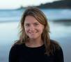
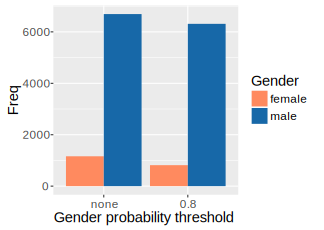

## Introduction

> to improve the participation and experience of women in the R community

<table id="nogrid">
<tr>
<td style="width:130px"></td>
<td>Jenny Bryan CA</td>
<td></td>
<td> Alicia Oshlack AU</td>
<td></td>
<td> Oliver Keyes US</td>
</tr>

<tr>
<td></td>
<td> Di Cook AU</td>
<td></td>
<td> Carolin Strobl CH</td>
<td></td>
<td> Kevin O'Brien IE</td>
</tr>

<tr>
<td></td>
<td>Julie Josse FR</td>
<td></td>
<td> Heather Turner UK</td>
<td></td>
<td> Michael Lawrence US</td>
</tr>
</table> 

## Data Gathering

## Packages

 - All CRAN maintainers (Mar 2016) processed with **genderizer**
    - uses databases to predict gender from first name
 - Supplemented by manual assignment
 - 14.8% package authors "female", 11.4% with P(gender) &ge; 0.8 only
 
 
 
## Other R Project Contributions

 - 18% Google Summer of Code 2015 mentors were women (9 individuals)
 - In remaining cases, percentages represent one or two women
 

## US Occupations

 - Data from American Community Survey 2014
 - 22% female programmers
 - Other scientific/analytic occupations at least 41% female
 
  
  
## Goals for R Community

 - Developers (CRAN maintainers, GSoC students, ISC funding holders) should at 
 least be comparable to computer science figures
    - &gt; 20% women
 - Broader user community (R conference attendees/speakers, RUG members) should at least be comparable to mathematical/natural sciences
    - 30-40% women

## Surveys

- Get input from the community on obstacles and ideas for improvements
- Target survey at particular populations, e.g.
    - useR! attendees
    - local user group attendees
    - package maintainers
    - R-help users
    - Stackoverflow users
    
 
**First survey is of useR! 2016 participants**

## Conferences

## useR! 

- At useR! 2016, 30% participants are women

- The percentage of female presenters is higher for lightning (25%) and poster 
(28%) vs talks (19%)

## Steps Forward

- Gradual increase in number of female keynotes
- Code of conduct introduced in 2015
- Diversity scholarships & mothers' room in 2016
    

## Future useR!s

WiR task force have made recommendations, including

 - Maintain current gender balance for invited speakers
 - Aim for similar gender balance for tutors
     - 28% tutorials have woman tutor this year
 - 50:50 program committee and session chairs
 - &ge; 20% women on any panels
 - Put gender statistics on conference website

 
**Childcare will be offered at useR! 2017**

## Communications

## Twitter

 @RWomenTaskforce  

## Supporting Women via Twitter

- Promote female-led R workshops/webinars etc
- Advertise R conferences/events
- Advertise opportunities for women (grants/awards/jobs etc)
- Support women advancing in R (via likes)
- Share articles/initiatives on encouraging diversity

**Have something to tweet/re-tweet?**

**Pacific**: @JennyBryan, jenny@stat.ubc.ca 
**GMT**: @dragonflystats, kobriendublin@gmail.com 
**AEST**: @AliciaOshlack, alicia.oshlack@mcri.edu.au

## Website

http://forwards.github.io/

**Looking for developers**

## Ideas for Further Activities

## Workshops

- Female only/males as +1s
- Majority female mentors
- Workshops in partnership with RUGs
    - **looking for partners**
- Developer summer school
    - Zurich 2018
    - **looking for organisers outside Europe for 2017**

## R-Ladies

- 2 active groups
    - the original: R-Ladies San Fransisco
    - new for 2016:  R-ladies London
 
 
    
**Looking for new founders**

## On Ramps for Contributing

- Several R packages on GitHub have a CONTRIBUTING.md 
    - often not designed for novices
- Target issues at novices
    - use tags
    - step-by-step instructions

## Supporting the Taskforce

 - Follow us @RWomenTaskforce
 - Complete our survey
 - Further opportunities:
    - Organisers/mentors for training
    - Web developers
    - R-ladies founders
    - Sponsors
 - Potential for co-ordinating funding applications
 - Ideas/offers to rowforwards@gmail.com

