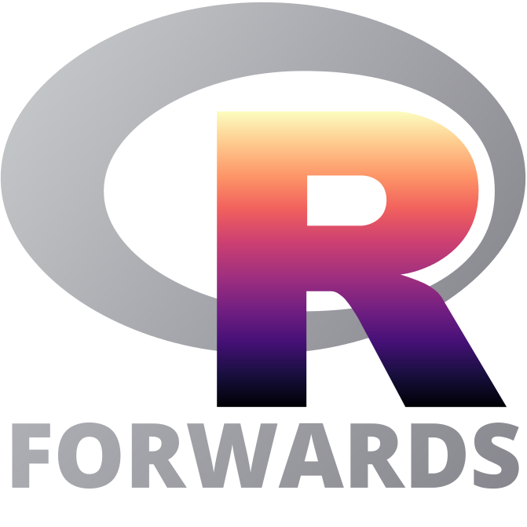
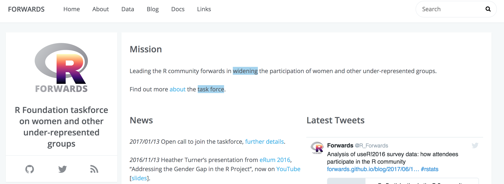
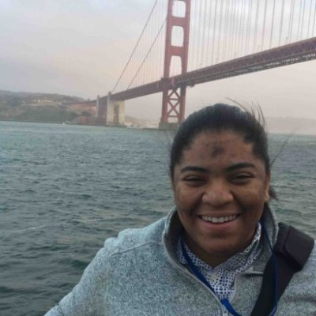
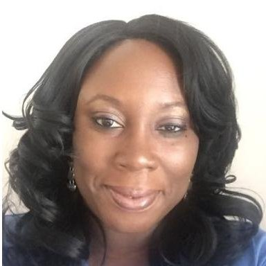

```{r setup, include=FALSE}
knitr::opts_chunk$set(echo = TRUE, warning  = FALSE)
```

# R Forwards taskforce on women and other underrepresented groups



## Presentation
   Aim: improve the participation and experience of underepresented groups in the R community.
 
- R foundation task force set up in December 2015 to address the underrepresentation of women (Rwomen)

<!--There is a gender gap in both user and developer communities
Women in R Taskforce has been established to address this.-->

- Rebranded in January 2017 to accomodate more underepresented groups: LGBT, minority etnic groups, people with disabilities 

- Website: https://forwards.github.io/
</td>
- Tweets: @R_Forwards, Facebook

## Core team

<div align = "center">
<table id="nogrid">
<tr>
<td style="width:130px"></td>
<td>Jenny Bryan</br>CA</td>
<td></td>
<td> Alicia Oshlack</br>AU</td>
<td></td>
<td>Jonathan Godfrey</br>NZ</td>
</tr>

<tr>
<td></td>
<td> Di Cook</br>AU</td>
<td></td>
<td> Carolin Strobl</br>CH</td>
<td></td>
<td> Kevin O'Brien</br>IE</td>
</tr>

<tr>
<td></td>
<td>Julie Josse</br>FR</td>
<td></td>
<td> Heather Turner</br>UK</td>
<td></td>
<td> Michael Lawrence</br>US</td>
</tr>

<tr>
<td></td>
<td>Emily Dodwell</br>US</td>
<td></td>
<td> Gina Griffin</br>US</td>
<td></td>
<td> Tracy Shen </br>US</td>
</tr>

<tr>
<td></td>
<td>David Smith </br>US</td>
<td></td>
<td>Jasmine Dumas</br>US</td>
<td></td>
<td> Madlene Hamilton  </br>US</td>
</tr>
</table> 
</div>


 
## Subteams {.smaller}

J. Lee, I. Mitra, N. Tamir
G. Merchant, C. Wickham, W. Qin, 
S. Bollman, R. Debelak, 
J. Fox, M. Salmon, J. Robbins, A. Foulkes,
H. Wickham.

Forwards teleconf/ slackathons (virtual asynchronous meetings on slack) on alternate months - Github Repo

- __Community__: General outreach to help people from under-represented groups get into R. Gina Griffin, Kevin O’Brien  

- __On-ramps__: Creating paths for useRs to develop their skills and make contributions to the R/BioConductor ecosystem. Jenny Bryan, Michael Lawrence

- __Social Media__: Posting to Twitter and/or Facebook, soliciting blog posts and publishing them, maintaining website. Tracy Shen, David Smith 

- __Teaching__: Materials and workshops for under-represented groups. Isabella Gollini, Di Cook.

- __Conferences__: liaising with OC/PC on policies and inclusion initiatives.  __Code of conducts, Childcare, Meet the diversity scholars, Conference buddies, R newbies session__ Heather Turner, Julie Josse


## Survey subteam{.smaller}


Run and analyse community surveys, collect data (data page).
Get input from the community on obstacles and ideas for improvements. Madlene Hamilton, Carolin Strobl, Jasmine Dumas 

- Data monitoring: \% women google summer of code mentors, students; R editors journals; ISC proposals, packages 2016: 11.4\%  (genderize package/manual)

<!--as conference attendees, speakers, committee members 
- At useR! 2016 results of recommendations -->

<!--- At useR! 2016: participants (28\%);  lightning (25%),  poster (28%), talks (19%) (2015: ~19\%); 50\% PC (results of recommendations) -->
 
<center></center>
Goal: numbers at least be comparable to computer science figures (>20\%)  mathematical/natural sciences (30-40\%)


<!-- possibly Rencontres stats here: 4/16 talks, 6/11 posters, 3/10 lightning -->


## useR!2016 survey{.smaller}

First survey during useR!2016 participants (June 27-30). N = 455/899  

__Demography__: gender, age, ethnic groups, country, education, employment, full-time/  part-time job, caregiver for children or adult dependents ?

__R programming__: 

Q11 How long have you been using R for?

Q12 Did you have previous programming experience before beginning to use R?

Tick any that apply among: 
Q13A I use functions from existing R packages to analyze data/ 
Q13B I write R code designed to make my work easier, such as loops or conditionals or functions/ 
Q13C I write R functions for use by myself or my collaborators/ 
Q13D I contribute to R packages (on CRAN or elsewhere)/
Q13E I have written my own R package/
Q13F I have written my own R package and released it on CRAN or Bioconductor (or shared it on GitHub, R-Forge or similar platforms)/

Q14 Do you use R as a recreational activity, primarily as part of a job or both?


## useR!2016 survey{.smaller}

Q15 How much do you agree or disagree with the following statements?
Writing R is fun/ considered cool by my peers?/ a monotonous task/ is difficult

Q16 Would you recommend R  as a programming language to learn?

Q17 What would be your number one argument for/against learning R?

__R community__

Q18 Do you consider yourself part of the R community?

Q19 Which of the following resources do you use for support? (The R mailing lists
Twitter, R StackOverflow, IRC channel, etc..

Q21 Do you attend R user group meetings in your local area?
...

- __Blog posts__: mapping useRs, users-relationship-with-r, useRs participation in the community
- __Reports__: Non-response in useR! 2016 Survey, useR!2016 participants and R programming: a multivariate analysis
- __R journal paper__ in preparation
Stella Bollmann, Dianne Cook, Rudolf Debelak, Jasmine Dumas, John Fox, Julie Josse, Oliver Keyes, Carolin Strobl, Heather Turner. 


<!-- Generally,
the respondents tended to be rather experienced R users. 369 respondents (83.48%) reported that they
had already worked with R for 2 years or longer, 
-->


# Results

## General findings 

- Demographics: experienced R users (83% > 2 years)

<center></center>

Under representation of non whites and LGTB


- UseRs relationship with R: 

<td></td>

<td></td>

<!--
- Gender differences (be careful younger women)
 
<td></td>
<!--Figure 5, men do it on their free time and women more work -> this is to investigate! 
<td></td>
<!--
So far, our results indicate that women respondents tended to be younger and have used R for a shorter amount of time than men respondents. Furthermore, we found that women respondents have contributed to R packages less often. From these bivariate analyses, however, we cannot assess whether the gender difference in package development is confounded with the usage length and programming experience, or whether there are gender differences beyond these effects, that may again
be confounded with the younger age of the women participants. Therefore, in the next section we
conduct a multiple logistic regression model to assess the partial effects of gender and the experience
variables on package writing. -->

<!--From this first logistic regression analysis, it looked like a large
part – but maybe not all – of the gender differences in the contribution to R packages were caused by
differences in the length of R usage (with women showing shorter usage lenths, as displayed...
<!--With respect to the interpretation of the effects of the additional variables included in this model,
for employment status we find that people working permanently and non-permanently in academia
contribute most to R packages, whereas those working in goverment/non-profit and industry are
slightly less likely to contribute to R packages 

Feeling as part of the R community goes along with
contributing more to R packages. Of course, the direction of this association may also be the other way
round, since people who have already contributed to R packages are more likely to feel as part of the
R community.
Again, the analysis does not give a clear answer to the question whether any gender differences in
package contributions remain beyond the differences already captured by the other predictor variables.
Any remaining differences might depend on a variety of other individual and structural factors, such
as differences in motivation or self-confidence, in access to information, or in networking and peer
support for contributing to R packages. After this first exploratory study, it would be very interesting
-->

<!-- More men have programming experience before working with R. with 338 respondents (73.80%) stating that they had
already had programming experience before working with R. -->

## R programming {.smaller}

Multiple Correspondence Analysis: dimensionality reduction. Similarities between individuals, relationship between variables

- Two categories are close when individuals who have selected the first category also tend to take the other category

<center></center>


## R programming {.smaller}

<td></td>
<td></td>

3 clusters:
__The experienced users (38%)__: more than 10 years’ experience, in depth knowledge of R programming, write their own package. Mainly  men, academic, with doctorate.  *Use R both for their job and for pleasure*.

__The intermediate users (57%)__: for less than 2 years, use functions from existing packages, do not write their own functions. Mainly women, people from industry, undergraduate or master degree, more from US. *Use R for their jobs*

__The curious users (3%)__: they have discovered R very recently. They don't have an opinion that is already formed. (9 people with less than 6 months experience).

<!-- Practices of R are linked to the experience of the users. In particular, users with more than 10 years’ experience have already written their own package, while people with less than 2 years’ experience haven’t. -->

<!--  A focus on the demographic characteristics of the participants highlights experienced users are more likely men than women, more likely from academia than from industry and more likely people with a doctorate than without. They often use R both for their job and for pleasure. Intermediate users use R for less than 2 years, they mainly use existing packages. Intermediate users are mainly women, people with undergraduate and master degrees and less men or people with doctoral degrees. Beginners are trying R during their free time.  -->

<!-- The first cluster located on the left represent the experienced users while the second cluster gathers the intermediate users and the third one the beginners. The fourth cluster is constituted with people who did not answer.
 To wrap-up, the tests results confirm that **cluster 1 gathers experienced users**. In this cluster, there is an over-representation of people with doctorate, men, or people employed in academia. It is also a cluster where the proportion of people strongly seeing R programming as fun is large. In the same line, people in cluster 1 are more likely to use R for both recreational and job/educational purposes. US people are under-represented in cluster 1.  We can imagine that only people deeply using R are motivated to go to the US for such a conference due to the costs.
 Cluster 2 can be described as a cluster of **intermediate users** who use R since 1-2 years or less, but more than 6 months. They use R functions, but don't write their own functions or packages. They appreciate R, but use it primarily for their job. They are more employed in the industry. This cluster gathers more women, more undergraduate and master and people from the US.
Cluster 3 gathers respondents with less than 6 months of experience in R. They do not have an opinion about the "fun" or "monotonous" nature of R. They use R in their free time and find that the main advantage of R is that it is an open source software. This cluster gather **curious users** discovering R in their free time. No demographic characteristics show-up in this group. 
-->

## R programming 

Men are more highly represented than women among the most advanced users. 

Age effect? 

<center></center>

<!--. it could be explained by the fact that women tend to be younger, 
To get more insight into this possible confounding effect, we created a variable sex-age and represent it. The plot confirms that men are over-represented amongst the advanced users. -->


## R community {.smaller}

Q18 Do you consider yourself part of the R community?

Q19 Which of the following resources do you use for support?  (The R mailing lists, The #rstats hashtag on Twitter, StackOverflow queues, The R IRC channel, The rOpenSci mailing lists or chat forums, The Bioconductor support site)

Q20 What would be your preferred medium for R community news ?

Q21 Do you attend R user group meetings in your local area?


Q24 Which of the following would make you more likely to participate in the R community, or improve your experience? Tick any that apply: A New R user group near me, New R user group near me aimed at my demographic, Free local introductory R workshops, Paid local advanced R workshops, R workshop at conference in my domain, R workshop aimed at my demographic, Online forum to discuss R-related issues, etc..

Q25 What other ideas do you have for improving the R community?


## R community {.smaller}

<center>
<td></td>
<td></td>
</center>


2 main clusters:
__Do not feel part of the R community__. (35\%) Do not attend RUG because feel inexperimented. __Would like to attend workshops/RUG/online support if close to them (geographic/ demographic)__. Use blogs to get help. 
Prefered medium for R community news: Facebook or mailing lists. __Do not use Twitter__, do not want to use it.
More women, master/undergraduate degree, young (men and women).

<!--On the top, there are respondents who do not attend R users group because they feel too inexperimented.  They 
think that they would be more likely to participate to the R community or to improve their experience, if a user group, a workshop, or an online support dedicated to their socio-demographic group would be available. 
Facebook would be their prefered medium for R community news. 
They do not use Twitter (question Q19_B), (the category R_twitter_no corresponds to the answer  _The #rstats hashtag on Twitter_ for the question _Which of the following resources do you use for support?_). In addition,  they do not like to use it as a medium for R community news (question Q20). 
They consider themselves as outside the R community. -->

__Feel part of the R community__. (61\%) Do not have time to participate to meetings. Attend general RUG meetings. Not interested in free workshops, online demos. Use Twitter. Twitter prefered medium for R community news.
More men, in academia with a doctorate.

<!--
On the bottom, in contrast, there are individuals who tend to consider themselves as part of the R community.
They attend general R users group meetings and they use Twitter. Twitter would be their prefered medium for R community news.

It appears that people having an undergraduate degree or a master degree are located at the top of the graph, while those with a doctorate are at the bottom. This would imply that people with undergraduate degree or master degree are more likely to consider themselves as ouside the R community than people having a doctorate. The same comment holds for women versus men.
Youngest people tend to be on the top of the second axe, which suggests that they consider themselves as outside the community.

It highlights that both young (male and female) and women do not consider themselves as part of the R community.
In this cluster, there is an overrepresentation of those who adhere to most of the proposals to increase their participation in the R community. Most of them have never participated in a user group meeting. The cluster gathers a large number of people who use blogs to get help, but also a large proportion of people who do not use Twitter. They prefer to use a medium like Facebook or mailing lists for news.

From a demographic point of view, the cluster contains a significantly higher proportion of women than the respondent population, and a larger proportion of those with a master's or undergraduate degree. People under the age of 30 are also overrepresented. -->
 
# Conclusion

## Survey

- Missing values/ Coding issues “yes” “no” answers for checkboxes <!--to distinguish missing values from “no”.-->

- Cautious about over-interpretation: women are younger

- Logistic regression: gender differences in R packages writting caused by lengths of R usage, employment in academia and a feeling of belonging to the R community. Ask women the frein to developp packages

- Other results on our website (a small group who do not like R)

- useR! attendees are not representative from the R community as a whole (depends on the location - Stanford)

- People willing to participate more

- Looking forwards to the new data


<!-- 
to further question women R users that are on the verge of becoming R developers what might be
keeping them back – as well as asking men R users that did cross over and become developers what
helped them take that step. -->
 
## Activities of Rforwards
 
- Development workshops for women engaged in research. Melbourne, Auckland, US, Europe, Workshops for teenage girls to encourage an interest in programming. 

- Send emails to invite friends submitting abstracts, attending conferences

- Ideas for improving R community, promote welcoming culture: 
a webpage introducing the community and how it is organized, 
publish guide for running local group, 
team participation in challenges,
mentorship, 
joint event with other data sciences groups, online conferences, ...

Lot of work! Thank you for the efforts to improve diversity and inclusion

 


  


                                                   

