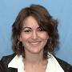

```{r setup, include=FALSE}
knitr::opts_chunk$set(echo = TRUE, warning  = FALSE)
```


## Welcome


- First Newbies session

- Introduction to the conference and the wider R community

- Short talks, open discussion and informal networking


## Program

- Julie Josse: Introduction & Intro to Forwards
- Erin LeDell: Introduction to R-Ladies
- David Smith: The R ecosystem
- Kevin O’Brien: Navigating the R community
- Laure Cougnaud: Making the most of useR!
- Break

- Heather Turner: useR! abstract review: what the program committee look for
- Maëlle Salmon: rOpenSci onboarding system and community
- Charlotte Wickham: Collaborative coding
- Julia Silge: Making a career from coding

- Gathering, drinks 

# R Forwards taskforce on women and other underrepresented groups


## Presentation
   Aim: improve the participation and experience of underepresented groups in the R community.
 
- R foundation task force set up in December 2015 to address the underrepresentation of women (Rwomen)

<!--There is a gender gap in both user and developer communities
Women in R Taskforce has been established to address this.-->

- Rebranded in January 2017 to accomodate more underepresented groups: LGBT, minority ethnic groups, people with disabilities 

- Website: https://forwards.github.io/
</td>
- Tweets: @R_Forwards

## Core team

<div align = "center">
<table id="nogrid">
<tr>
<td style="width:130px"></td>
<td>Jenny Bryan</br>CA</td>
<td></td>
<td> Alicia Oshlack</br>AU</td>
<td></td>
<td>Jonathan Godfrey</br>NZ</td>
</tr>

<tr>
<td></td>
<td> Di Cook</br>AU</td>
<td></td>
<td> Carolin Strobl</br>CH</td>
<td></td>
<td> Kevin O'Brien</br>IE</td>
</tr>

<tr>
<td></td>
<td>Julie Josse</br>FR</td>
<td></td>
<td> Heather Turner</br>UK</td>
<td></td>
<td> Michael Lawrence</br>US</td>
</tr>

<tr>
<td></td>
<td>Emily Dodwell</br>US</td>
<td></td>
<td> Gina Griffin</br>US</td>
<td></td>
<td> Tracy Shen </br>US</td>
</tr>

<tr>
<td></td>
<td>David Smith </br>US</td>
<td></td>
<td>Jasmine Dumas</br>US</td>
<td></td>
<td> Madlene Hamilton  </br>US</td>
</tr>
</table> 
</div>

## Subteams {.smaller}

J. Lee, I. Mitra, N. Tamir
G. Merchant, C. Wickham, W. Qin, 
S. Bollman, R. Debelak, 
J. Fox, M. Salmon, J. Robbins, A. Foulkes,
H. Wickham.

Forwards teleconf/ slackathons (virtual asynchronous meetings on slack) on alternate months - Github Repo

- __Community__: General outreach to help people from under-represented groups get into R. Gina Griffin, Kevin O’Brien  

- __On-ramps__: Creating paths for useRs to develop their skills and make contributions to the R/BioConductor ecosystem. Jenny Bryan, Michael Lawrence

- __Social Media__: Posting to Twitter and/or Facebook, soliciting blog posts and publishing them, maintaining website. Tracy Shen, David Smith 

- __Teaching__: Materials and workshops for under-represented groups. Isabella Gollini, Di Cook.

- __Conferences__: liaising with OC/PC on policies and inclusion initiatives.  __Code of conducts, Childcare, Meet the diversity scholars, Conference buddies, R newbies session__ Heather Turner, Julie Josse


 
## Subteams {.smaller}


- __Survey__: Run and analyse community surveys, collect data (data page)
Get input from the community on obstacles and ideas for improvements. Madlene Hamilton, Carolin Strobl, Jasmine Dumas 

To know more the demographics and opinions: first survey during useR! 2016 participants

- Blog posts: Mapping useRs, users-relationship-with-r, useRs Participation in the R Community
- Reports: Non-response in useR! 2016 Survey, useR! 2016 participants and R programming: a multivariate analysis
- R journal paper in preparation. 
Stella Bollmann, Dianne Cook, Rudolf Debelak, Jasmine Dumas, John Fox, Julie Josse, Oliver Keyes, Carolin Strobl, Heather Turner. 

You are invited to participate in the survey!

__Wish you a terrific conference__


  


                                                   

